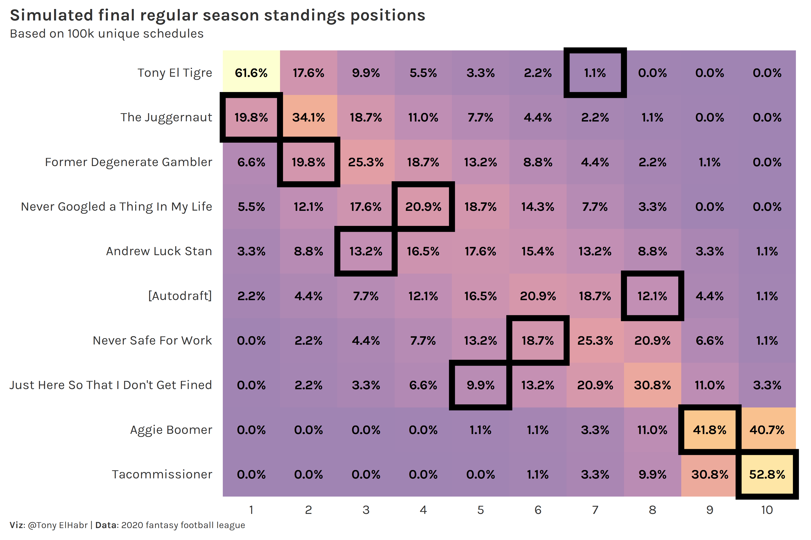
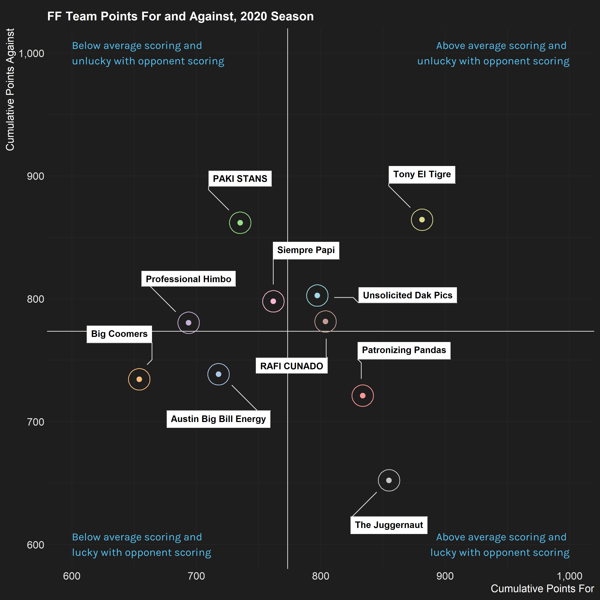
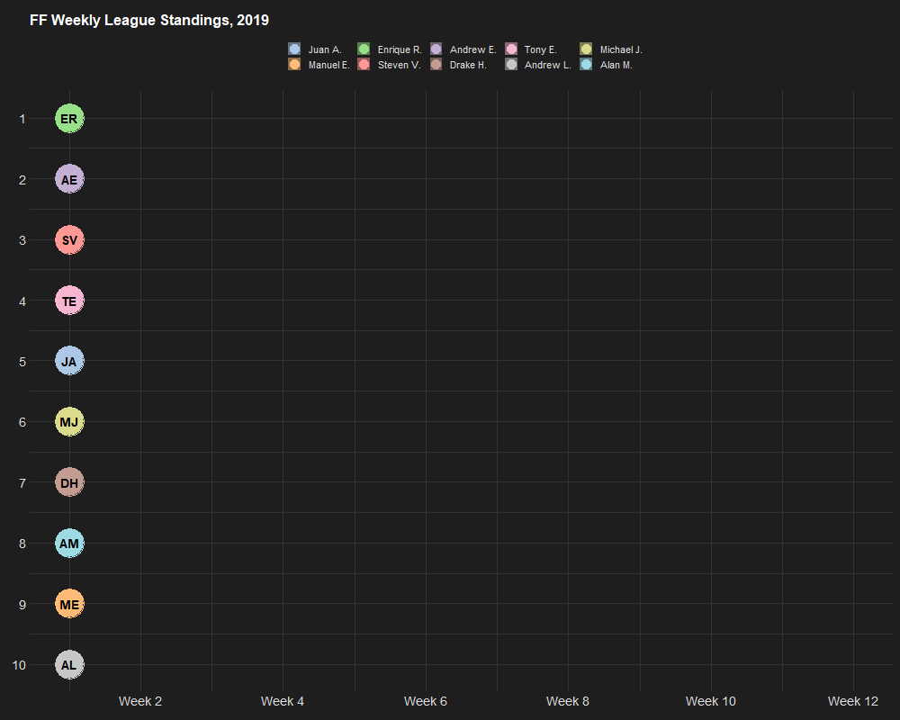
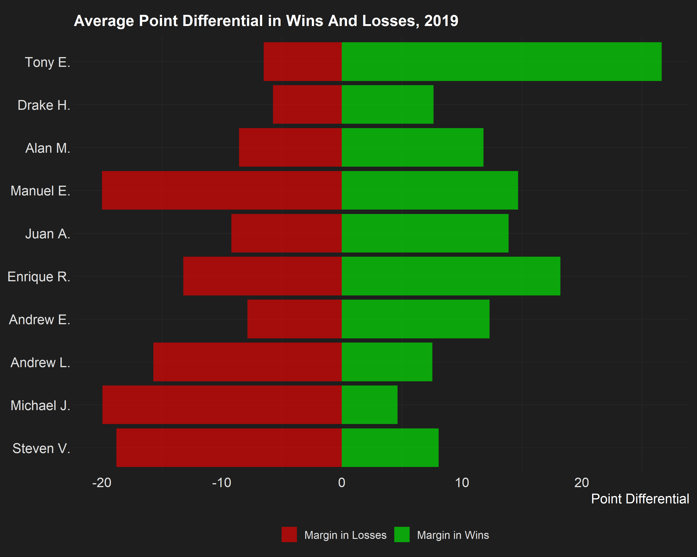
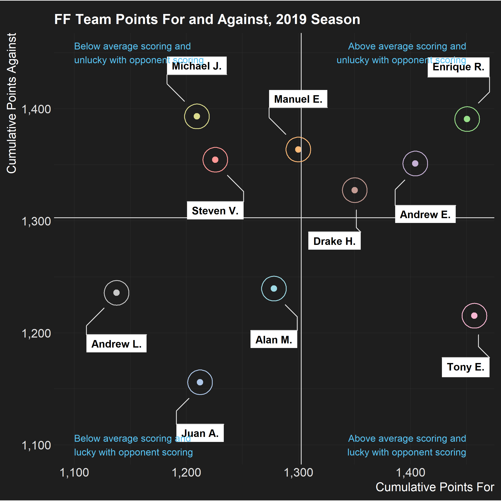
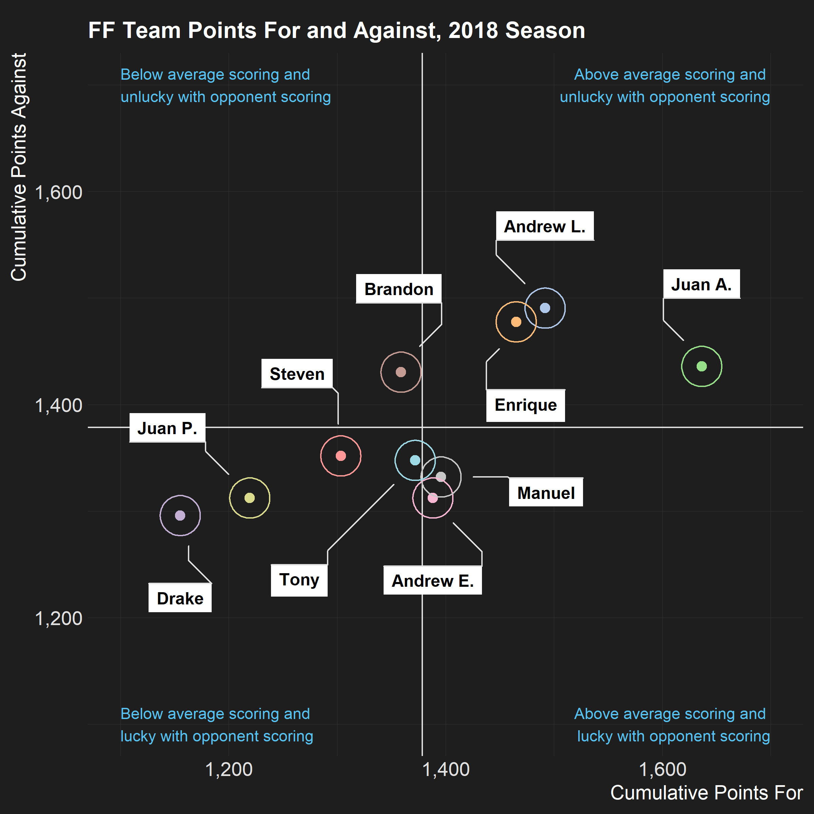

This repo stores some ad-hoc analysis and visualizations of personal
fantasy football (FF) data. While 2018 and 2019 plots required more work
to put together due to the league being private, the 2020 data
collection scrapes directly from ESPN because the league is now public.
In fact, I’ve created a package—`{ffsched}`—to help with collecting ESPN
FF data, and, more interestingly, to simulate unique schedules. This
allows us to answer the question “How likely was the final standings?”

### 2020

#### End-of-year

*Actual team names have been aliased due to some NSFW names.*

#### Week 7

### 2019

### 2018

